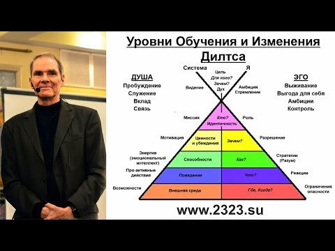

Пирамида логических уровней, разработанная Робертом Дилтсом, представляет собой модель, используемую в нейролингвистическом программировании (НЛП), чтобы понять, как различные аспекты человеческого опыта взаимосвязаны и влияют друг на друга. Эта модель является ключевой для понимания изменений и развития личности.

`Чтобы решить проблему, нужно подняться над ней`

**1. Духовность/Миссия:** Наивысший уровень пирамиды. Здесь рассматриваются вопросы смысла жизни, предназначения и связи с чем-то большим, чем сам человек. Этот уровень отвечает за глубокие жизненные цели и миссию.

**2. Идентичность:** Следующий уровень связан с самооценкой, самоидентификацией и вопросом "Кто я?". Идентичность формирует, как человек видит себя в контексте мира.

**3. Убеждения и Ценности:** Этот уровень определяет, во что человек верит, какие у него ценности и убеждения, которые направляют его выбор и поведение.

**4. Навыки и Способности:** Здесь фокусируются конкретные навыки и способности, которые человек использует для достижения своих целей. Это может включать профессиональные навыки, коммуникативные способности и т.д.

**5. Поведение:** На этом уровне рассматривается, что человек фактически делает – его действия и поведение в различных ситуациях.

**6. Окружение:** Самый нижний уровень, включающий в себя физическую и социальную среду, в которой человек находится. Это место, люди вокруг и внешние обстоятельства.

Пирамида нейрологических уровней Дилтса используется в НЛП для диагностики и планирования изменений, позволяя понять, на каком уровне необходимо работать для достижения желаемых изменений в жизни или поведении человека. Эта модель помогает осознать, как изменения на одном уровне могут влиять на другие уровни, создавая более глубокое и системное понимание личности и её развития.

# Дополнительный уровень

**Кто мы? (Принадлежнос):** Этот уровень расширяет понятие "Идентичности" до социальных групп, к которым принадлежит человек. Это могут быть семья, рабочий коллектив, национальность, культурная или религиозная группа и т.д. На этом уровне анализируется, как членство в этих группах влияет на убеждения, ценности, поведение и взгляды человека.

# Материалы

[Пирамида Логических уровней Роберта Дилтса. Объясняет сам Роберт Дилтс ](https://www.youtube.com/watch?v=_0UuXBB6P6Q)

[Пирамида Дилтса: что это и чем она может помочь 🔺🔻](https://invme.com/ru/blogs/content/piramida-diltsa)

## \*\*Ситуация

Скажем, ваша проблема заключается в следующем – меня не ценят и не уважают мой труд на работе. Как разобрать ее по пирамиде Дилтса?

1. Окружение. На этом уровне вы должны ответить на вопрос: «Кто именно должен меня ценить?». Начальство.
1. Поведение. «Что я должен делать, чтобы меня ценили? Что должно сделать начальство, чтобы я понял, что меня ценят?» Например, ваш ответ такой: «Я должен показывать хорошие результаты работы, а начальство должно меня хвалить и поощрять».
1. Способности. «Какие я должен проявить качества и навыки, чтобы начальство меня ценило?». Например, решительность, креативность и ответственность.
1. Ценности. «Почему для меня так важно, чтобы меня ценило начальство?». Ваш ответ может быть: «Чтобы я понимал, что я ценный сотрудник, без которого компания будет работать хуже».
1. Идентичность. «Кем я должен быть, чтобы меня ценило начальство?». Например: «Человеком, в котором нуждаются».
1. Миссия. Мы доходим до самого сложного и иногда болезненного вопроса: «Зачем мне это?». И здесь нужно приложить немало усилий, чтобы дойти до истины. Может быть, вам откроются воспоминания, которые вы предпочли бы давно забыть или что-то, что вызовет у вас негативные эмоции. Например, ваш ответ: «Потому что так я смогу доказать себе и родителям, что я могу добиться успеха»

Данные получены из открытых источников  или GPT моделей  и отредактированы  для персональной базы знаний [по продуктовой трансформации](https://psf.master-strategy.ru/strategy-is.shtml).
