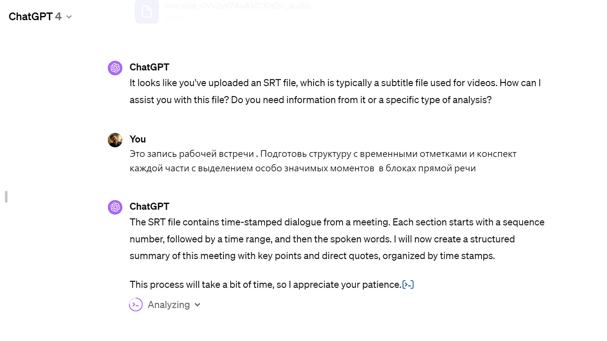

Это набор моих запросов для работы с текстами

# Обработка транскрипции подкаста

Как профессиональный редактор со специализацией в \<нейробиологии> структурируй текст подкаста сохраняя стиль и основные тезисы автора убери только оговорки и возможные ошибки распознавания , добавь заголовки , выдели 3 ключевых ключевые тега.

# База знаний

Опиши краткую историю развития модели открытых инноваций , дай определение и предложи несколько примеров продуктов созданных благодаря этой теории 

# Книга

Опиши основные принципы легшие в основу книги Джеaфри Мура Зона победы Управление в эпоху цифровой трансформации, опиши основные тезисы оппонентов и зачем ее читать руководителю инновационных продуктов

\#prompt

