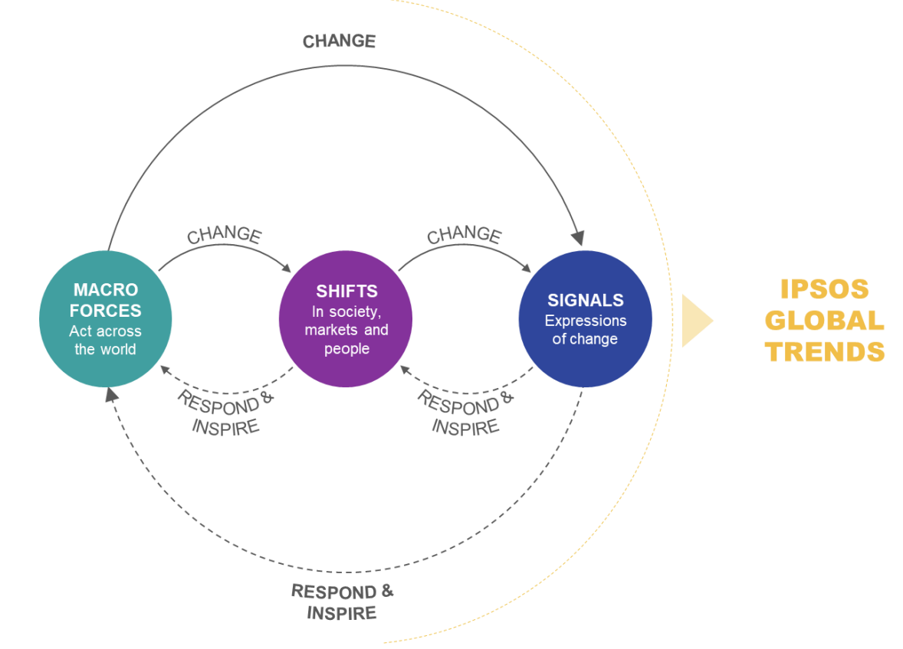

Теория изменений Ipsos помогает нам взглянуть на изменения на нескольких уровнях
Мы использовали этот фреймворк для выделения 12-ти трендов в 2020-м году и для мониторинга того, как они развиваются со временем.
•	Макросилы действуют на широком уровне и оказывают далеко идущее воздействие внутри стран и за их пределами.
•	Сдвиги - это изменения в ценностях и установках социума, рынков и людей, которые
мы отслеживаем с течением времени.
•	Сигналами являются локальные изменения, такие как запуск новых продуктов, появление новых технологий, стартапов и пр.

\#trendwatching
