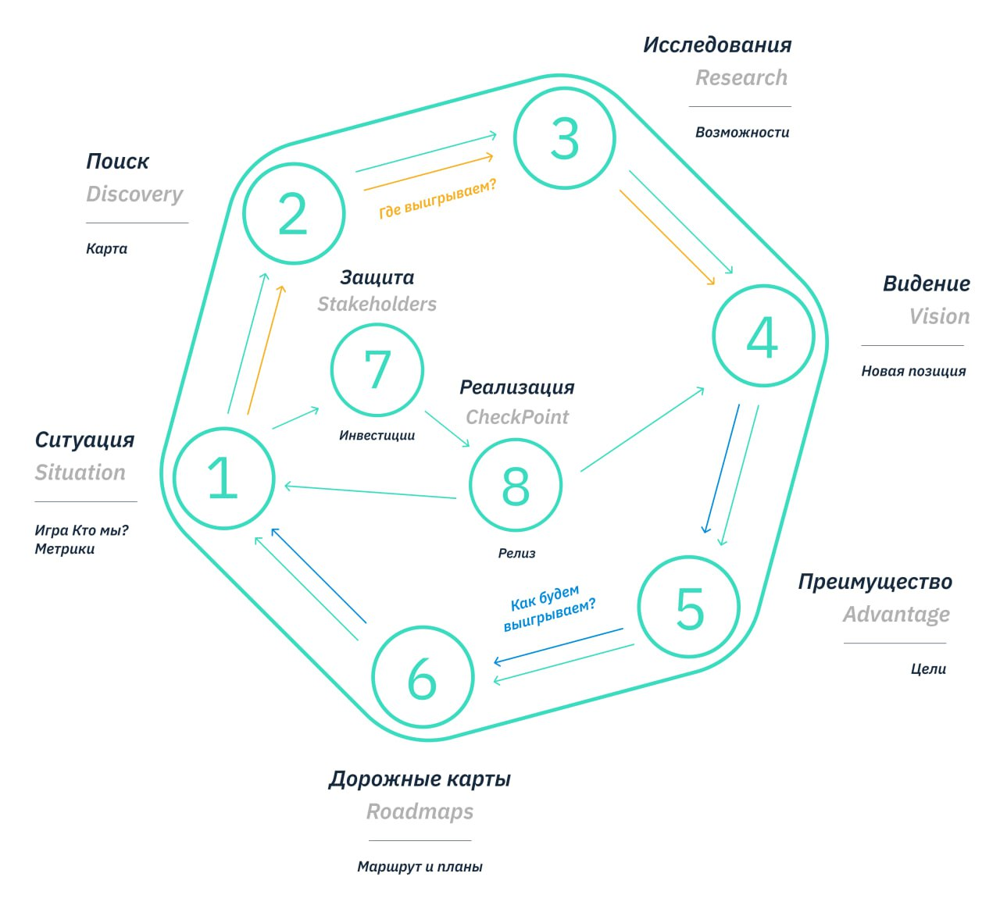
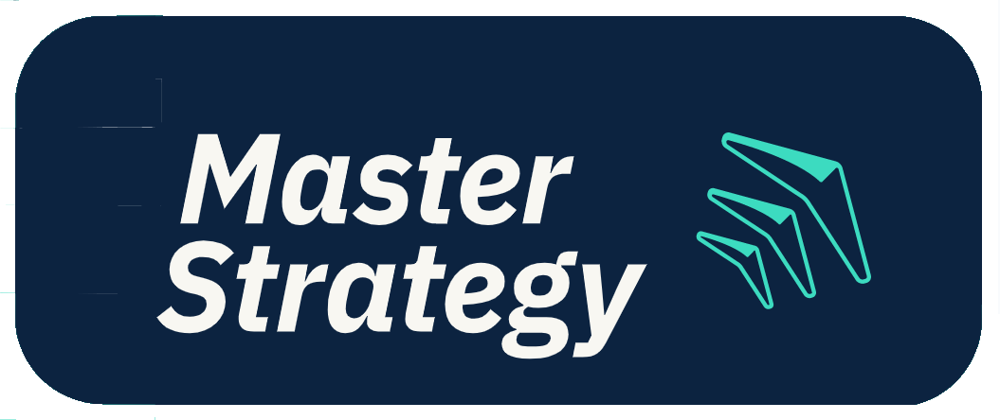

## Обзор фреймворка принятия комплексных стратегических решений

После 10 лет практики по работе со стратегией различного уровня  и 4-х лет практики развития  навыков стратегического мышления в [Стратегической Мастерской](https://master-strategy.ru/), мы пришли к системе стратегического управления, которая применима для разных уровней принятия стратегических решений и помогает создать синергию всех необходимых для принятия решений дисциплин.

Фреймворк состоит  из 4-х основных  этапов  на каждом из которых используются свои [Принципы принятия решений](%D0%9C%D0%BE%D0%B4%D0%B5%D0%BB%D0%B8/%D0%9F%D1%80%D0%B8%D0%BD%D1%86%D0%B8%D0%BF%D1%8B%20%D0%BF%D1%80%D0%B8%D0%BD%D1%8F%D1%82%D0%B8%D1%8F%20%D1%80%D0%B5%D1%88%D0%B5%D0%BD%D0%B8%D0%B9.md) и шаги:

# [Этап I Поиск лучших возможностей](%D0%A1%D1%82%D1%80%D0%B0%D1%82%D0%B5%D0%B3%D0%B8%D1%87%D0%B5%D1%81%D0%BA%D0%B8%D0%B9%20%D1%86%D0%B8%D0%BA%D0%BB%20%D1%83%D0%BF%D1%80%D0%B0%D0%B2%D0%BB%D0%B5%D0%BD%D0%B8%D1%8F/%D0%AD%D1%82%D0%B0%D0%BF%20I%20%D0%9F%D0%BE%D0%B8%D1%81%D0%BA%20%D0%BB%D1%83%D1%87%D1%88%D0%B8%D1%85%20%D0%B2%D0%BE%D0%B7%D0%BC%D0%BE%D0%B6%D0%BD%D0%BE%D1%81%D1%82%D0%B5%D0%B9.md) 

Чего Мы хотим ?  (Ценностный выбор)

* [Шаг 1 Ситуация](%D0%A1%D1%82%D1%80%D0%B0%D1%82%D0%B5%D0%B3%D0%B8%D1%87%D0%B5%D1%81%D0%BA%D0%B8%D0%B9%20%D1%86%D0%B8%D0%BA%D0%BB%20%D1%83%D0%BF%D1%80%D0%B0%D0%B2%D0%BB%D0%B5%D0%BD%D0%B8%D1%8F/%D0%A8%D0%B0%D0%B3%201%20%D0%A1%D0%B8%D1%82%D1%83%D0%B0%D1%86%D0%B8%D1%8F.md). Внутренние возможности и угрозы. Чего мы хотим ? ( Situation)
* [Шаг 2 Пространство](%D0%A1%D1%82%D1%80%D0%B0%D1%82%D0%B5%D0%B3%D0%B8%D1%87%D0%B5%D1%81%D0%BA%D0%B8%D0%B9%20%D1%86%D0%B8%D0%BA%D0%BB%20%D1%83%D0%BF%D1%80%D0%B0%D0%B2%D0%BB%D0%B5%D0%BD%D0%B8%D1%8F/%D0%A8%D0%B0%D0%B3%202%20%D0%9F%D1%80%D0%BE%D1%81%D1%82%D1%80%D0%B0%D0%BD%D1%81%D1%82%D0%B2%D0%BE.md) Внешний возможности и угрозы Как в целом меняется рынок и какие возможности и угрозы это создает ? (Discovery)
  [Этап II Формирование (обновление) видения](%D0%A1%D1%82%D1%80%D0%B0%D1%82%D0%B5%D0%B3%D0%B8%D1%87%D0%B5%D1%81%D0%BA%D0%B8%D0%B9%20%D1%86%D0%B8%D0%BA%D0%BB%20%D1%83%D0%BF%D1%80%D0%B0%D0%B2%D0%BB%D0%B5%D0%BD%D0%B8%D1%8F/%D0%AD%D1%82%D0%B0%D0%BF%20II%20%D0%A4%D0%BE%D1%80%D0%BC%D0%B8%D1%80%D0%BE%D0%B2%D0%B0%D0%BD%D0%B8%D0%B5%20%28%D0%BE%D0%B1%D0%BD%D0%BE%D0%B2%D0%BB%D0%B5%D0%BD%D0%B8%D0%B5%29%20%D0%B2%D0%B8%D0%B4%D0%B5%D0%BD%D0%B8%D1%8F.md).  
  Где победим ? Стратегический выбор
* [Шаг 3 Исследование возможностей и угроз](%D0%A1%D1%82%D1%80%D0%B0%D1%82%D0%B5%D0%B3%D0%B8%D1%87%D0%B5%D1%81%D0%BA%D0%B8%D0%B9%20%D1%86%D0%B8%D0%BA%D0%BB%20%D1%83%D0%BF%D1%80%D0%B0%D0%B2%D0%BB%D0%B5%D0%BD%D0%B8%D1%8F/%D0%A8%D0%B0%D0%B3%203%20%D0%98%D1%81%D1%81%D0%BB%D0%B5%D0%B4%D0%BE%D0%B2%D0%B0%D0%BD%D0%B8%D0%B5%20%D0%B2%D0%BE%D0%B7%D0%BC%D0%BE%D0%B6%D0%BD%D0%BE%D1%81%D1%82%D0%B5%D0%B9%20%D0%B8%20%D1%83%D0%B3%D1%80%D0%BE%D0%B7.md). (Research)
* [Шаг 4 Видение (Концепция)](%D0%A1%D1%82%D1%80%D0%B0%D1%82%D0%B5%D0%B3%D0%B8%D1%87%D0%B5%D1%81%D0%BA%D0%B8%D0%B9%20%D1%86%D0%B8%D0%BA%D0%BB%20%D1%83%D0%BF%D1%80%D0%B0%D0%B2%D0%BB%D0%B5%D0%BD%D0%B8%D1%8F/%D0%A8%D0%B0%D0%B3%204%20%D0%92%D0%B8%D0%B4%D0%B5%D0%BD%D0%B8%D0%B5%20%28%D0%9A%D0%BE%D0%BD%D1%86%D0%B5%D0%BF%D1%86%D0%B8%D1%8F%29.md) Чего мы хотим достичь и на каких направлениях нужно  сосредоточиться чтобы его реализовать (Vision)

# [Этап III Стратегическое планирование.](/404)

Как победим? Проектирование решения

* [Шаг 5 Страт.направления](/404). Какие преимущества нам необходимы и как мы их создадим? 
* [Шаг 6 Интегрированные дорожные карты](%D0%A1%D1%82%D1%80%D0%B0%D1%82%D0%B5%D0%B3%D0%B8%D1%87%D0%B5%D1%81%D0%BA%D0%B8%D0%B9%20%D1%86%D0%B8%D0%BA%D0%BB%20%D1%83%D0%BF%D1%80%D0%B0%D0%B2%D0%BB%D0%B5%D0%BD%D0%B8%D1%8F/%D0%A8%D0%B0%D0%B3%206%20%D0%98%D0%BD%D1%82%D0%B5%D0%B3%D1%80%D0%B8%D1%80%D0%BE%D0%B2%D0%B0%D0%BD%D0%BD%D1%8B%D0%B5%20%D0%B4%D0%BE%D1%80%D0%BE%D0%B6%D0%BD%D1%8B%D0%B5%20%D0%BA%D0%B0%D1%80%D1%82%D1%8B.md) (Strategy driven roadmap)
  * Каковы наши конкретные шаги для достижения поставленных целей?

# [Этап IV Защита и реализация](%D0%A1%D1%82%D1%80%D0%B0%D1%82%D0%B5%D0%B3%D0%B8%D1%87%D0%B5%D1%81%D0%BA%D0%B8%D0%B9%20%D1%86%D0%B8%D0%BA%D0%BB%20%D1%83%D0%BF%D1%80%D0%B0%D0%B2%D0%BB%D0%B5%D0%BD%D0%B8%D1%8F/%D0%AD%D1%82%D0%B0%D0%BF%20IV%20%D0%97%D0%B0%D1%89%D0%B8%D1%82%D0%B0%20%D0%B8%20%D1%80%D0%B5%D0%B0%D0%BB%D0%B8%D0%B7%D0%B0%D1%86%D0%B8%D1%8F.md) 

Как продвигаемся? Решения на основе данных.

* [Шаг 7. Получение ресурсов Защита стратегии перед инвесторами (Инвестиционный комитет)](/404) 
  
  * Как убедить инвесторов в правильности нашего стратегического курса
  * Защита стратегии перед инвесторами (Инвестиционный комитет)
* [Шаг 8 Управление реализацией стратегии](%D0%A1%D1%82%D1%80%D0%B0%D1%82%D0%B5%D0%B3%D0%B8%D1%87%D0%B5%D1%81%D0%BA%D0%B8%D0%B9%20%D1%86%D0%B8%D0%BA%D0%BB%20%D1%83%D0%BF%D1%80%D0%B0%D0%B2%D0%BB%D0%B5%D0%BD%D0%B8%D1%8F/%D0%A8%D0%B0%D0%B3%208%20%D0%A3%D0%BF%D1%80%D0%B0%D0%B2%D0%BB%D0%B5%D0%BD%D0%B8%D0%B5%20%D1%80%D0%B5%D0%B0%D0%BB%D0%B8%D0%B7%D0%B0%D1%86%D0%B8%D0%B5%D0%B9%20%D1%81%D1%82%D1%80%D0%B0%D1%82%D0%B5%D0%B3%D0%B8%D0%B8.md) (Продуктовый комитет)
  
  * Как мы будем управлять выполнением стратегии и корректировать её при необходимости?
* 
   > 
   > \[!info\]
   > 
   > * https://master-strategy.ru/ - Стратегическая мастерская
   > * http://psf.master-strategy.ru/ - База знаний стратегической мастерской
   > * Подписаться на канал Дмитрия Безуглого
  
  
  
